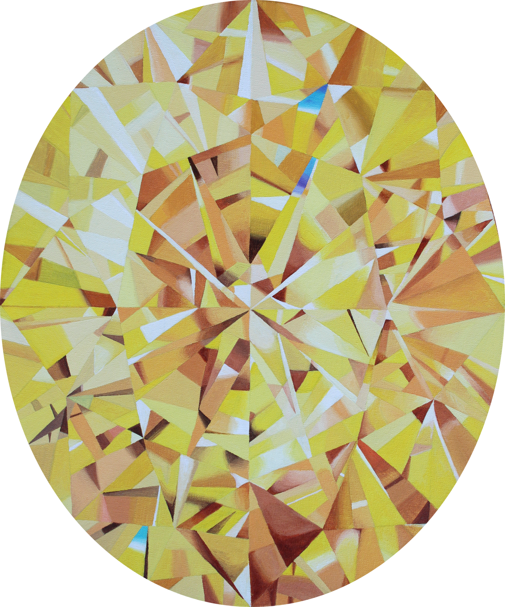
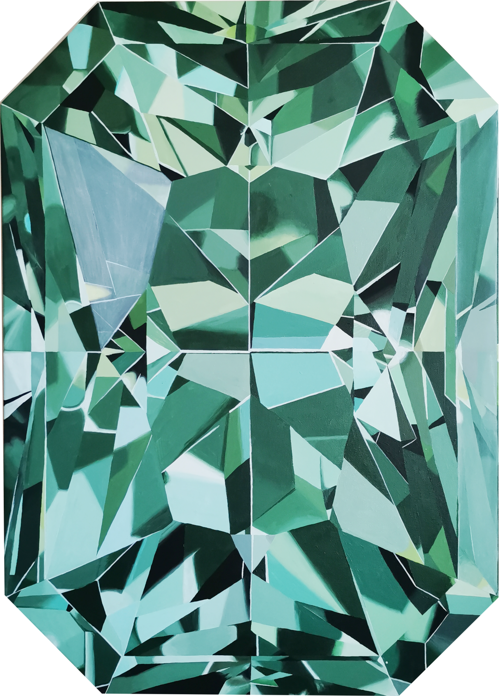
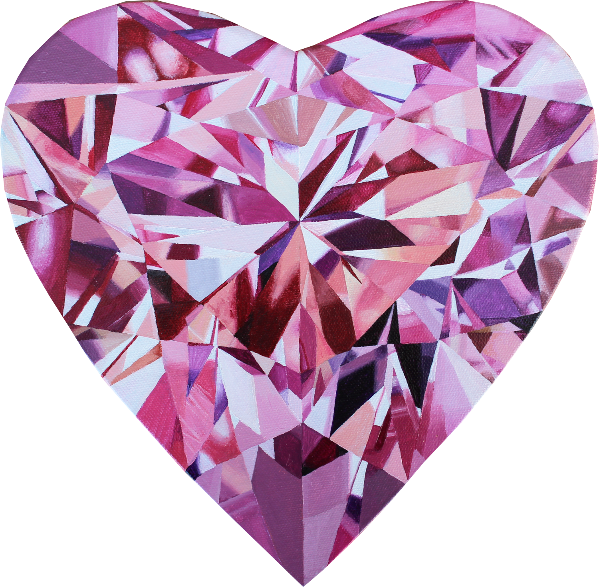

# ARt App

## Mikä ARt-sovellus on?

**ARt** on lisätyn todellisuuden (AR) taidekokemus, jonka avulla näyttelyn teokset heräävät eloon. Voit tarkastella teosten lisätietoja ja taustoja, tutkia teoksen mallina ollutta jalokiveä 3D-mallina, sekä sovittaa maalauksia oman kotisi seinälle. Kaikki näyttelyn jalokiviteokset on nimetty Hollywoodin kulta-ajan näyttelijätähtien mukaan. ARt-sovelluksen avulla tutustut itse taiteen lisäksi myös erilaisiin jalokiviin sekä näyttelijöihin teosten nimien takana.

Sovellus sisältää kaksi osiota:

- ARt Gallery
- ARt Wall

## ARt Gallery

**ARt Gallery** -ominaisuuden avulla voit tarkastella teoksia, jalokiviä ja niihin liittyviä tarinoita suoraan mobiililaitteesi kameran kautta. Kun suuntaat kameran taideteosta kohti, näet 3D‑mallin, teostiedot ja lisäsisältöä elävänä kerroksena ympäristössäsi.

1. **Salli kameran käyttö**  
Sovellus pyytää lupaa kameran käyttöön ensimmäisellä käynnistyskerralla. Hyväksy lupa, jotta AR‑sisältö voidaan näyttää.
2. **Suuntaa kamera kohdekuvaan**  
Etsi näyttelytilasta jalokivimaalaus ja suuntaa kamera sitä kohti. Kun kohde tunnistetaan, 3D‑malli ja valikko ilmestyvät automaattisesti.
3. **Tutki 3D‑mallia**  
Voit liikkua mallin ympärillä ja liikutella kameraasi. Malli pyörii kevyesti, jotta yksityiskohdat näkyvät selkeästi.
4. **Avaa lisäsisältö**  
Kun kohde on tunnistettu, näet kolme painiketta:
    - Teoksen tekniset tiedot
    - Kiven ominaisuudet ja taustat
    - Teoksen nimen esikuvana olevan näyttelijän esittely

## ARt Wall

**ARt Wall** ‑ominaisuuden avulla voit kokeilla, miltä teokset näyttäisivät omalla seinälläsi. ARt Wall auttaa hahmottamaan moten teos sopii tilaan ennen ostopäätöstä.  

Näin käytät ARt Wallia:

- Valitse teos, jonka haluat sovittaa seinälle
- Aktivoi ARt‑tila (START AR-painike)
- Suuntaa kameraa kotisi seinää kohti niin että ruudulle ilmestyy target-ympyrä
- Napauta ruutua ja teos ilmestyy seinälle oikeassa mittasuhteessa
- Voit lisätä seinälle niin monta eri teosta kuin haluat
- Klikkaamalla samaa teosta uudelleen, voit siirtää sitä seinällä

## Teokset

ARt App sisältää tällä hetkellä 20 eri teoksen tiedot ja 3d-mallit. Kohdekuvat löytyvät [/assets/images/targetImages](/assets/images/targetImages/) -kansiosta.

    

## Sovellus

Sovellusta voit käyttää osoitteessa: [tyynekaisa.github.io/ARt-app/](https://tyynekaisa.github.io/ARt-app/)

## Lähdekoodi

Lähdekoodi löytyy GitHub reposta: [Tyynekaisa/ARt-app](https://github.com/Tyynekaisa/ARt-app)

## © Copyrights (all rights reserved)

#### Art:

- Anna-Kaisa Juhola (@artbyannakaisa)

#### Photos and images:

- Mikko Karesmaa (background.jpg)
- Anna-Kaisa Juhola (target images, logos)

#### 3D Models:

- Anna-Kaisa Juhola
